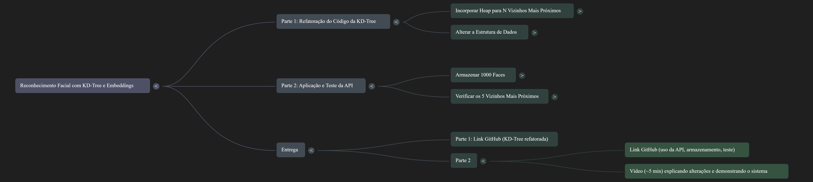

# Projeto: Reconhecimento Facial com KD-Tree e Embeddings

O objetivo é desenvolver um sistema de reconhecimento facial utilizando uma base de embeddings armazenados em uma KD-Tree (Árvore Binária de Busca k-dimensional modificada).



## ✨ Funcionalidades

- ✅ Inserção de embeddings (float[128] + ID) na KD-Tree
- ✅ Busca do vizinho mais próximo
- 🔄 Busca dos **N vizinhos mais próximos** usando Heap
- 🔄 Implementação própria de Heap (Max Heap)
- ✅Geração de embeddings com **Deepface** ou link do professor do colab
- ✅ Exportação de embeddings em `.json`
- ✅ Suporte para integração com API (em desenvolvimento)


## 📂 Estrutura do Projeto

```
📁 Trabalho-ED/
├── kdtreee.c              # Código principal com KDTree 
├──kdtree_wrapper.py       #compila o codigo c pra py
├──app.py                 #geração dos endpoints da api
├──heap.c              # Implementação da Heap
├── heap.h/.c          # Implementação da Heap
├── embeddings.json        # Arquivo de saída com os embeddings gerados
├──  kdtreee.dll # # Carrega a biblioteca compilada no windows dll     
└── facenet_embedding.ipynb     # Script para gerar os embeddings a partir do LFW no deepface
├── requeriments.txt      #comandos para a execução
```
## 🎯 Parte 1: Refatoração do Código da KD-Tree

O código base fornecido (originalmente para dados de latitude e longitude) precisa ser refatorado para:

#### (🛠️Em desenvolvimento)
 1. Incorporar Heap para Busca dos N Vizinhos Mais Próximos
   - **Objetivo:** Modificar o algoritmo de busca da KD-Tree para retornar os **N** vizinhos mais próximos de um ponto de consulta.
   - **Técnica:** Utilizar um **heap** (max-heap de tamanho N) para manter eficientemente os N candidatos mais próximos encontrados durante a varredura da árvore.
   - **Lógica:**
     - Ao visitar um nó, calcular a distância.
     - Se o heap tiver menos de N elementos, adicionar o ponto.
     - Se o heap estiver cheio e o ponto atual for mais próximo que o mais distante no heap, remover o mais distante e adicionar o atual.
     - Otimizar a poda da árvore usando o raio da k-ésima distância atual no heap.

#### (✅Desenvolvido)
  2. Alterar a Estrutura de Dados
   - **Objetivo:** Adaptar a estrutura de dados da KD-Tree para armazenar informações de faces.
   - **Novos Campos:**
     - **Embedding da Face:** Um vetor de **128 floats**.
     - **ID da Pessoa:** Uma **string de até 100 caracteres**.
   - **Impactos:**
     - **Nós da Árvore:** Devem ser capazes de armazenar ou referenciar o embedding e o ID.
     - **Função de Distância:** Deve ser atualizada para calcular a distância entre vetores de 128 dimensões (e.g., distância Euclidiana).
       $$d(p, q) = \sqrt{\sum_{i=1}^{128} (p_i - q_i)^2}$$
     - **Critério de Divisão:** A árvore continuará a ciclar pelas dimensões (`dimensão % 128`) para dividir o espaço.

---

## 🎯 Parte 2: Aplicação e Teste da API

Com a KD-Tree modificada e sua API funcionando:
(✅Desenvolvido)
#### 1. Armazenar 1000 Faces (✅Desenvolvido)
   - **Fonte dos Embeddings:** Utilizar o código fornecido no Colab ([link](https://colab.research.google.com/drive/1Xq-H-Agj6o1paiA6SAKSeoDeX3kRj739?usp=sharing)) para gerar os embeddings de 128 dimensões a partir de imagens.
   - **Dataset:** Utilizar imagens do dataset **LFW (Labeled Faces in the Wild)**, além de imagens da **sua face** e de **mais duas pessoas conhecidas**.
   - **Processo:**
     1. Obter imagens.
     2. Gerar o embedding para cada imagem usando a pipeline do Colab.
     3. Criar um ID para cada face.
     4. Usar a API da KD-Tree para inserir cada par (embedding, ID) na árvore, totalizando 1000 faces.

#### 2. Verificar os 5 Vizinhos Mais Próximos (🛠️Em desenvolvimento)
   - **Objetivo:** Testar a precisão da busca k-NN.
   - **Processo:**
     1. Gerar os embeddings para a sua face e para as faces das duas pessoas conhecidas (que já estão na árvore).
     2. Para cada um desses três embeddings de teste, consultar a KD-Tree para encontrar os **5 vizinhos mais próximos** (N=5).
     3. Verificar se o ID correto (seu ou da pessoa conhecida) está presente na lista dos 5 vizinhos retornados pela API.

---
### ❔ Como executar  👩‍💻:
 Os comandos necessarios para executar o projeto estão presentes no arquivo requeriments.txt e o arquivo do colab com o codigo de geração de embeddings em .json a partir de fotos.
 
---


##   Entrega

- **Parte 1:** Link para o código no GitHub contendo a KD-Tree refatorada.
- **Parte 2:**
    - Link para o código no GitHub contendo a solução da Parte 2 (uso da API, armazenamento e teste).
    - Vídeo de aproximadamente 5 minutos explicando as principais alterações no código e demonstrando o sistema em funcionamento.


